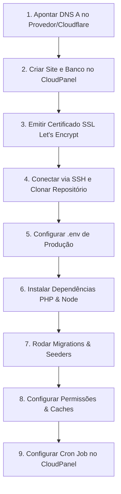

# 🚀 Guia de Deploy em Produção — VPS com CloudPanel
### Caderneta EBD Online (Assembleia de Deus em Teotônio Vilela)

Este guia prático e detalhado descreve o passo a passo completo para publicar o sistema **Caderneta EBD Online** na sua VPS gerenciada com **CloudPanel**, utilizando as configurações reais do seu servidor.

---

## 📌 Dados do Ambiente de Produção

| Configuração | Valor Definido |
| :--- | :--- |
| **Domínio da Aplicação** | `https://ebd.adteotoniovilela.com.br` |
| **Endereço de IP da VPS** | `72.60.142.2` |
| **Usuário SSH do Site** | `adteotoniovilela-ebd` |
| **Diretório Raiz do Site** | `/home/adteotoniovilela-ebd/htdocs/ebd.adteotoniovilela.com.br` |
| **Diretório Público Web (DocRoot)** | `/home/adteotoniovilela-ebd/htdocs/ebd.adteotoniovilela.com.br/public` |
| **Versão do PHP** | PHP 8.3 ou superior (PHP 8.3 / 8.4 / 8.5) |
| **Banco de Dados MySQL** | `ebdigital` |
| **Usuário do Banco MySQL** | `ebdigital` |
| **Repositório GitHub** | `https://github.com/rayhenrique/ebdigital.git` |

---

## 🗺️ Visão Geral do Fluxo



---

## Passo 1: Configuração do DNS (Apontamento de Domínio)

No seu gerenciador de DNS (Cloudflare, Registro.br, Hostinger, etc.), crie o seguinte registro para direcionar o subdomínio para o IP da VPS:

- **Tipo**: `A`
- **Nome / Host**: `ebd` *(resultará em `ebd.adteotoniovilela.com.br`)*
- **Endereço IPv4 / Destino**: `72.60.142.2`
- **TTL**: `Automático` (ou `3600`)
- **Proxy (caso use Cloudflare)**: Pode deixar com a nuvem laranja ativada (com SSL em modo *Full / Completo*) ou em modo *DNS Only* durante a emissão do certificado Let's Encrypt.

---

## Passo 2: Configurações no CloudPanel

Conforme já configurado nas telas do seu CloudPanel:

### 2.1. Criação do Site PHP
1. Vá em **Sites** > **Adicionar Site** > **Criar um Site PHP**.
2. **Inscrição / Template**: Selecione `Laravel 13` (ou `PHP genérico` com root em `/public`).
3. **Nome do domínio**: `ebd.adteotoniovilela.com.br`
4. **Versão do PHP**: Escolha `PHP 8.3`, `PHP 8.4` ou `PHP 8.5` (o Laravel 13 exige PHP >= 8.2).
5. **Usuário do site**: `adteotoniovilela-ebd`
6. **Senha do usuário do site**: Defina uma senha forte ou gere uma nova (guarde esta senha para o acesso SSH/SFTP).
7. Clique em **Criar**.

### 2.2. Verificação do Diretório Raiz
1. Entre nas configurações do site recém-criado e clique na aba **Definições**.
2. Certifique-se de que o **Diretório raiz** está apontando para:
   ```text
   ebd.adteotoniovilela.com.br/public
   ```
   *(Caminho físico: `/home/adteotoniovilela-ebd/htdocs/ebd.adteotoniovilela.com.br/public`)*
3. Se necessário, clique em **Salvar**.

### 2.3. Criação do Banco de Dados MySQL
1. Clique na aba **Bancos de dados** > **Adicionar banco de dados**.
2. **Nome do banco de dados**: `ebdigital`
3. **Nome de usuário do banco de dados**: `ebdigital`
4. **Senha do usuário do banco de dados**: Gere e **anote a senha com segurança** (ela será inserida no arquivo `.env`).
5. Clique em **Adicionar banco de dados**.

### 2.4. Emissão do Certificado SSL Gratuito (Let's Encrypt)
1. Clique na aba **SSL/TLS**.
2. Selecione a opção **Ações** > **Novo Certificado Let's Encrypt**.
3. Marque o domínio `ebd.adteotoniovilela.com.br` e clique em **Criar e Instalar**.
4. O CloudPanel renovará este certificado automaticamente a cada 90 dias.

---

## Passo 3: Acesso SSH na VPS e Clonagem do Projeto

Abra o terminal do seu computador (PowerShell, Git Bash ou Linux/Mac) e acerte a conexão SSH com o usuário do site:

```bash
# Conecte-se com o usuário do site criado no CloudPanel:
ssh adteotoniovilela-ebd@72.60.142.2
```
*(Digite a senha definida no CloudPanel para o usuário `adteotoniovilela-ebd`).*

### 3.1. Preparar o Diretório e Clonar o Código
O CloudPanel cria a pasta do site com um arquivo de boas-vindas padrão. Vamos esvaziá-la e clonar o repositório:

```bash
# Entre na pasta do site:
cd /home/adteotoniovilela-ebd/htdocs/ebd.adteotoniovilela.com.br

# Remova os arquivos iniciais padrão do CloudPanel:
rm -rf * .git*

# Clone o repositório diretamente no diretório atual:
git clone https://github.com/rayhenrique/ebdigital.git .
```

> [!TIP]
> **E se o repositório for alterado para Privado no GitHub?**
> Se você tornar o repositório privado, use um **Personal Access Token (PAT)** ou clone via SSH com Deploy Key:
> ```bash
> git clone https://<SEU_TOKEN_GITHUB>@github.com/rayhenrique/ebdigital.git .
> ```
> Ou configure sua chave pública SSH em: *Repositório GitHub > Settings > Deploy Keys*.

---

## Passo 4: Configuração das Variáveis de Ambiente (`.env`)

Crie o arquivo `.env` de produção a partir do modelo pré-configurado:

```bash
# Copie o arquivo de exemplo:
cp .env.example .env

# Abra para edição:
nano .env
```

Ajuste os seguintes campos essenciais no arquivo `.env`:

```ini
APP_NAME="Caderneta EBD"
APP_ENV=production
APP_KEY=
APP_DEBUG=false
APP_TIMEZONE=America/Maceio
APP_URL=https://ebd.adteotoniovilela.com.br

APP_LOCALE=pt_BR
APP_FALLBACK_LOCALE=pt_BR
APP_FAKER_LOCALE=pt_BR

# Configuração do Banco de Dados MySQL criado no CloudPanel
DB_CONNECTION=mysql
DB_HOST=127.0.0.1
DB_PORT=3306
DB_DATABASE=ebdigital
DB_USERNAME=ebdigital
DB_PASSWORD=COLE_AQUI_A_SENHA_QUE_VOCE_GEROU_NO_CLOUDPANEL

# Sessão e Cache em Banco de Dados para alta performance
SESSION_DRIVER=database
SESSION_LIFETIME=120
CACHE_STORE=database
QUEUE_CONNECTION=database
```

Salve e saia do editor nano: pressione `Ctrl + O`, depois `Enter`, e em seguida `Ctrl + X`.

---

## Passo 5: Instalação de Dependências & Compilação de Assets

Execute os comandos na ordem abaixo dentro do diretório `/home/adteotoniovilela-ebd/htdocs/ebd.adteotoniovilela.com.br`:

```bash
# 1. Gerar a chave de criptografia da aplicação
php artisan key:generate

# 2. Instalar dependências PHP otimizadas para produção
composer install --no-dev --optimize-autoloader

# 3. Instalar dependências do Frontend e compilar Tailwind CSS / Vite
npm install
npm run build
```

> [!NOTE]
> Se o comando `npm` não estiver disponível no usuário do site, você pode compilá-lo como `root` ou garantir que o Node.js está habilitado para o usuário via CloudPanel Settings. Caso prefira, pode compilar no seu PC (`npm run build`) e subir a pasta `public/build` via SFTP ou Git.

---

## Passo 6: Migrações, Seeders e Permissões de Arquivos

### 6.1. Executar as Tabelas e Carga Inicial
Crie toda a estrutura de banco de dados (usuários, classes, presenças, auditoria) e os usuários padrão de teste:

```bash
php artisan migrate --force --seed
```

> 🔑 **Usuários gerados automaticamente pelo Seeder:**
> - **Pastor / Administrador**: `admin@ebd.local` | Senha: `password`
> - **Secretário Geral**: `secretaria@ebd.local` | Senha: `password`
> - **Professor**: `professor@ebd.local` | Senha: `password`
>
> *(Após o primeiro acesso, altere as senhas na tela de usuários ou no perfil).*

### 6.2. Permissões de Pastas
O Laravel precisa de permissão de escrita nas pastas `storage` e `bootstrap/cache`:

```bash
chmod -R 775 storage bootstrap/cache
```

### 6.3. Otimização de Cache em Produção
Acelere o carregamento do Laravel compilando as rotas, views e configurações em cache:

```bash
php artisan config:cache
php artisan route:cache
php artisan view:cache
```

---

## Passo 7: Configuração do Agendamento (Cron Job no CloudPanel)

O sistema possui uma rotina automática para expirar logs de auditoria antigos a cada domingo à noite (`ebd:prune-audit-logs`). Para que o agendador do Laravel funcione:

1. No painel do CloudPanel, acesse o site `ebd.adteotoniovilela.com.br`.
2. Clique na aba **Cron Jobs** > **Adicionar Cron Job**.
3. Configure:
   - **Descrição**: `Laravel Scheduler EBD`
   - **Padrão / Intervalo**: Selecione **A cada minuto** (`* * * * *`)
   - **Comando**:
     ```bash
     php /home/adteotoniovilela-ebd/htdocs/ebd.adteotoniovilela.com.br/artisan schedule:run >> /dev/null 2>&1
     ```
4. Clique em **Salvar**.

---

## Passo 8: Script de Atualização Rápida (Deploy Contínuo)

Para não precisar digitar todos os comandos a cada atualização do sistema, criamos um script chamado `deploy.sh` na raiz do projeto.

Sempre que você fizer alterações no código e der `git push` no seu computador, basta rodar no terminal da VPS:

```bash
# Conecte no servidor:
ssh adteotoniovilela-ebd@72.60.142.2

# Entre na pasta e execute o script de deploy:
cd /home/adteotoniovilela-ebd/htdocs/ebd.adteotoniovilela.com.br
bash deploy.sh
```

O script atualizará o Git, instalará novos pacotes, rodará novas migrações, compilará o front-end e renovará todos os caches automaticamente!

---

## 🔍 Checklist de Validação Final

Após concluir os passos:

1. [ ] Acesse `https://ebd.adteotoniovilela.com.br` no navegador do celular e computador.
2. [ ] Verifique se o cadeado SSL (HTTPS) está verde e seguro.
3. [ ] Faça login com o usuário administrador (`admin@ebd.local` / `password`).
4. [ ] Teste a navegação: **Dashboard**, **Chamadas**, **Classes**, **Alunos**, **Usuários**.
5. [ ] Altere a senha padrão do administrador no menu Perfil ou Usuários.
6. [ ] Crie as classes e cadastre os primeiros alunos da igreja.

---

**Caderneta EBD Online** — Igreja Evangélica Assembleia de Deus em Teotônio Vilela/AL.  
*Desenvolvido com excelência técnica e foco mobile-first.*
